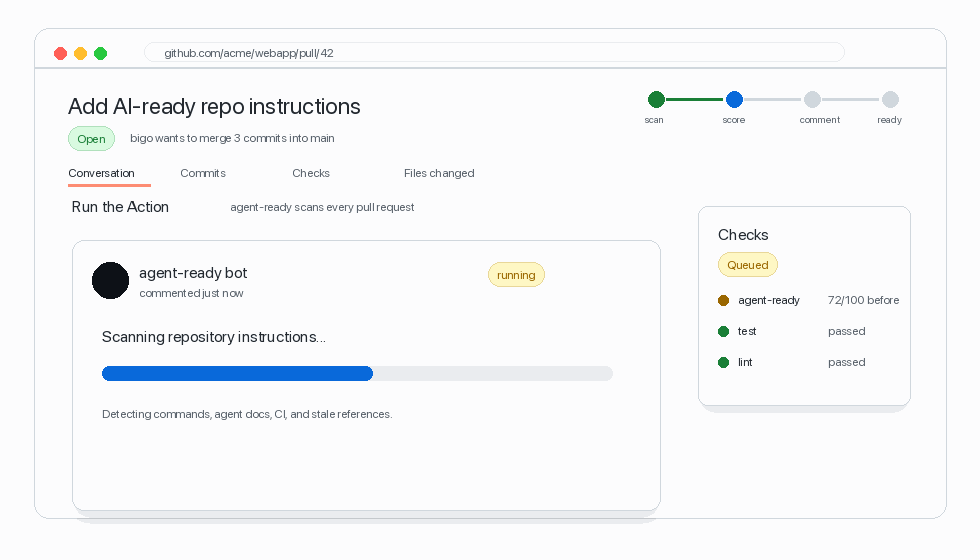

# agent-ready Showcase

`agent-ready` turns repository-specific AI coding instructions into a small, testable contract. It gives maintainers a score, creates canonical agent docs, and can post a pull request summary that tells contributors exactly what is ready and what still needs work.

<p align="center">
  
</p>

## What Users See

When `comment: true` is enabled in the reusable GitHub Action, each pull request gets one maintained readiness comment:

```md
## Agent Ready

**Score:** 100/100 (A)
**Status:** ready
**Agent compatibility:** 5/5 ready

No readiness fixes are currently needed.

### Compatibility
| Agent | Status | Mode | Files |
| --- | --- | --- | --- |
| OpenAI Codex | ready | canonical | `AGENTS.md` |
| Cursor | ready | shim | `.cursor/rules/agent-ready.mdc` |
| GitHub Copilot | ready | shim | `.github/copilot-instructions.md` |
| Claude Code | ready | shim | `CLAUDE.md` |
| Gemini CLI | ready | shim | `GEMINI.md` |

Generated by `agent-ready comment`.
```

The Action updates the existing comment instead of creating a new one on every run.

## Copy-Paste Workflow

```yaml
name: Agent Ready

on:
  pull_request:
  push:
    branches: [main]

permissions:
  contents: read
  pull-requests: write
  issues: write

jobs:
  agent-ready:
    runs-on: ubuntu-latest
    steps:
      - uses: actions/checkout@v4
      - uses: EShener/agent-ready@v0.1.18
        with:
          fail-under: 80
          comment: true
```

Generate the same workflow from the CLI:

```bash
npx --yes github:EShener/agent-ready ci --comment --write
```

## 60 Second CLI Path

```bash
npx --yes github:EShener/agent-ready doctor
npx --yes github:EShener/agent-ready explain
npx --yes github:EShener/agent-ready improve --level team --dry-run
npx --yes github:EShener/agent-ready improve --dry-run --format issue
npx --yes github:EShener/agent-ready fix --dry-run
npx --yes github:EShener/agent-ready fix --level team --dry-run
npx --yes github:EShener/agent-ready leaderboard ../repo-a ../repo-b
npx --yes github:EShener/agent-ready fix
npx --yes github:EShener/agent-ready comment
```

## Why It Is Different

- One canonical `AGENTS.md`, with small shims for Claude Code, Cursor, Gemini CLI, and GitHub Copilot.
- A score that explains what is missing instead of only saying "pass" or "fail".
- CI annotations, Step Summary output, badges, reports, benchmarks, and PR comments from the same scan.
- Zero runtime dependencies for the published CLI.

## Benchmark Evidence

On a 2026-05-23 sample of six public AI/devtool repositories, the average Agent Readiness Score was 28/100 before using `agent-ready`. See [../BENCHMARK.md](../BENCHMARK.md) for the reproducible snapshot and sample commits.

## Launch Snippet

```md
AI coding agents fail when repos do not tell them how to build, test, and stay safe.

agent-ready adds a score, AGENTS.md generation, CI annotations, a compatibility matrix for Codex/Cursor/Copilot/Claude/Gemini, and an auto-updated PR comment.

Try it:

npx --yes github:EShener/agent-ready improve --dry-run --format issue
```
